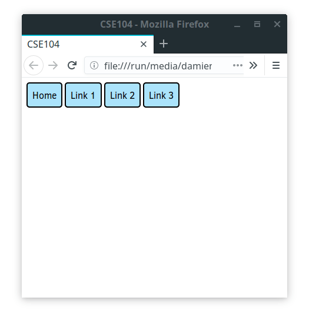
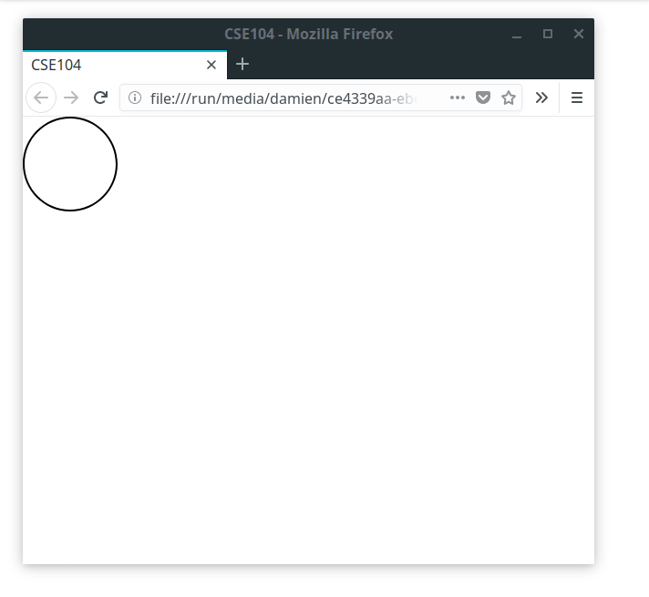

# CSE104 - Web programming (HTML, CSS, JAVASCRIPT, PHP) 网络编程

## Declaration
CSE104 is the courses held by Professor **Rohmer Damien** at Ecole Polytechnique. Thank to his generosity about all the information published on his webpage, which have more info about this course. here is the [link](https://imagecomputing.net/damien.rohmer/teaching/cse104/index.html)

Web Programming (CSE 104) introduces the languages, tools, and techniques specific to develop web-based applications. Students will develop a solid understanding of contemporary, dynamic and responsive website development following the current standards.

This is a hands-on practical course focusing on HTML/CSS and JavaScript language, as well as introducing server programming with PHP. At the end of the course, students will be able to program from scratch their own dynamic website.

## Professors
- [Rohmer Damien](https://imagecomputing.net/damien.rohmer/)

## Course Organization
- 3 lectures (2h) and 11 Tutorials (2h) 28 hours in total with 3 ECTS

## 📚 Objective
* Being able to develop a client-side-based website
* Being introduced to server side programming
* Being able to autonomously find and use information from various documentation on web applications

## 📚 Arrangement of this course

* [x] Part 1: HTML, CSS



* [x] Part 2: Javascript



```javascript
"use strict";

document.onmousemove = function(event) {
    let x = event.clientX - 40;
    let y = event.clientY - 40;

    const mouse = document.querySelector(".mouse");
    mouse.style.transform = `translate(${x}px, ${y}px)`;
}

let color = ['green', 'red', 'yellow'];
let index = 0;
let remainder = 0;

document.addEventListener("keyup", keyenter)

function keyenter(event) {
    if (event.keyCode == 13) {
        index += 1;
        remainder = index % 3
        const mouse = document.querySelector(".mouse");
        mouse.style.backgroundColor = color[remainder];
    }
}
```

* [x] Part 3: Introduction to server side programming: PHP, and short introduction to nodeJS

## Tools of this course
Terminal, VScode, HTML, CSS, Javascript
